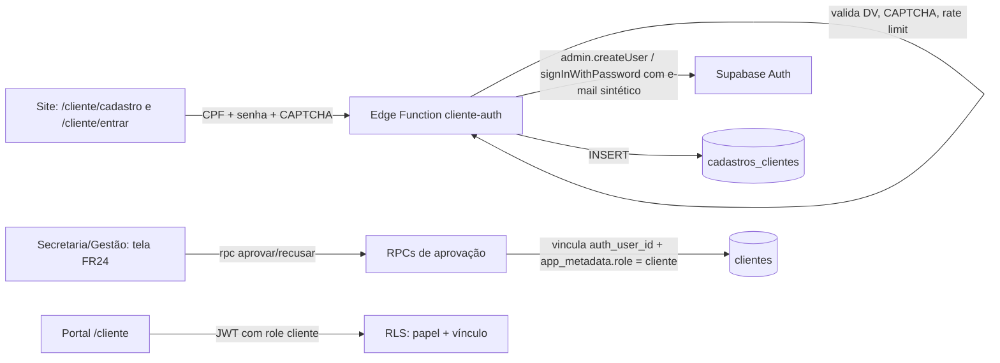

# ADR-007: Autenticação do Cliente por CPF com Aprovação da Secretaria (OQ-4 / Gate G2.8)

- **Status:** Aprovado. Opção B aprovada pelo usuário em 2026-09-24; D4 e OQ-5 (conferência de identidade e retenção) resolvidos por decisão do proprietário em 2026-09-24. Continua **PENDENTE** apenas o texto do termo de consentimento (§3.9)  
- **Data:** 2026-09-24 (revisões em 2026-09-24: decisão do proprietário sobre D4 e OQ-5; decisão do proprietário confirmando a expiração de pendentes em 30 dias, a conferência pelo telefone já cadastrado e a exclusão imediata da conta Auth na recusa)  
- **Autor:** Aria (@architect, Holistic System Architect); DDL/RLS final: `@data-engineer`  
- **Contexto:** PRD v1.4 — FR2, FR3, FR17, FR18, FR24, NFR12, NFR13, NFR16, NFR19 (1 a 8), OQ-4, OQ-5, G2.8, R-15, R-17, R-18, R-19; Story 2.20 (a ser dividida); ADR-001; ADR-005  

---

## 1. Contexto e Problema

O proprietário decidiu (PRD v1.4) que o cliente **se cadastra no site usando o CPF como login** e só acessa o portal `/cliente` **depois que a Secretaria ou a Gestão aprova** o cadastro numa tela do módulo Clientes (FR24).

O Supabase Auth autentica por e-mail ou telefone, não por CPF. Além disso:

- **CPF não é segredo** (R-17): aparece em nota fiscal, cadastros de loja, vazamentos.
- **Enumeração** (R-18): mensagens diferentes para "CPF já cadastrado"/"não encontrado" revelam quem é cliente da oficina.
- **Mapeamento no front** (R-19): resolver CPF → e-mail no navegador expõe dados e abre enumeração.
- O cadastro precisa ser **vinculado** ao registro existente em `public.clientes` sem duplicar o cliente (NFR19.6).

Hoje o portal do cliente é liberado pela simples presença de `dev_oficina_cliente_ativo` no `localStorage` (contornável pelo console), e a Story 1.1 AC10 proíbe o auto-cadastro até este fluxo existir com o gate G2.8 aprovado.

---

## 2. Opções Avaliadas

| | Opção | Resumo | Veredito |
|---|---|---|---|
| A | E-mail sintético derivado do CPF, login direto do front | Front calcula `cpf@dominio` (ou hash sem segredo) e chama `signInWithPassword` | **Rejeitada** |
| **B** | **Edge Function `cliente-auth` + e-mail sintético por HMAC com pepper** | Todo cadastro, login e recuperação passam pelo servidor | **APROVADA** |
| C | OTP por telefone/SMS | Login pelo telefone com código por SMS | **Rejeitada** |

**Por que A foi rejeitada:** o mapeamento CPF → e-mail seria calculável por qualquer pessoa, que chamaria o Supabase Auth direto, sem CAPTCHA, sem rate limit por CPF e sem controle das respostas (NFR19.2 e NFR19.4 inviáveis). O cadastro exigiria signup público do Supabase Auth ligado, deixando o endpoint aberto para criação em massa.

**Por que C foi rejeitada:** custo recorrente de provedor de SMS; o identificador passa a ser o telefone, contrariando o FR17 (CPF como login); risco de troca de chip (SIM swap); o cliente sem celular próprio fica sem acesso.

*(Também descartado: provedor de identidade próprio emitindo JWT customizado — exige gestão de chaves e de sessão fora do Supabase, desproporcional ao MVP.)*

---

## 3. Decisão (Opção B)

### 3.1 Visão geral



### 3.2 Identidade no Supabase Auth: e-mail sintético por HMAC

- E-mail interno: `c_{HMAC-SHA256(pepper, cpf_digitos)[0..40 hex]}@clientes.invalid`.
- O `pepper` é secret exclusivo da Edge Function (`CLIENTE_CPF_PEPPER`), nunca no front nem no banco. **Sem o pepper ninguém calcula o e-mail**, então não há como chamar o Supabase Auth direto contornando CAPTCHA e rate limit.
- A conta é criada com `email_confirm: true` (nenhum e-mail é enviado ao domínio sintético).
- Validação obrigatória na POC: confirmar que o Supabase Auth aceita o domínio `.invalid`; se não aceitar, usar um subdomínio controlado pela oficina sem registro MX.
- Rotação do pepper exige regravar o e-mail de todas as contas (`admin.updateUserById`) — procedimento documentado, não rotina.
- O e-mail sintético **nunca** é exibido ao cliente nem à equipe.

### 3.3 Onde vive o cadastro: `public.cadastros_clientes`

```text
public.cadastros_clientes
  id                     text PK default gen_random_uuid()::text
  auth_user_id           uuid UNIQUE NULL REFERENCES auth.users(id) ON DELETE SET NULL  -- NULL após recusa/expiração (§3.6, §3.9)
  cpf_digitos            text NOT NULL             -- 11 dígitos, validado no servidor
  nome, telefone         text NOT NULL
  email_contato          text NULL                 -- opcional, só para contato
  consentimento_em       timestamptz NOT NULL      -- LGPD (NFR19.5)
  versao_termo           text NOT NULL
  status                 text CHECK (status IN ('pendente','aprovado','recusado','expirado'))
  cliente_id             text NULL REFERENCES clientes(id)
  identidade_conferida   boolean NOT NULL default false
  metodo_conferencia     text NULL
  decidido_por           uuid NULL, decidido_em timestamptz NULL, motivo_recusa text NULL
  created_at, updated_at timestamptz
  UNIQUE parcial (cpf_digitos) WHERE status IN ('pendente','aprovado')
```

- Em `public.clientes`: nova coluna `auth_user_id UUID UNIQUE REFERENCES auth.users(id) ON DELETE SET NULL` (análoga a `funcionarios.auth_user_id`). A comparação de CPF usa **dígitos normalizados** (coluna gerada ou expressão sobre `cpf_cnpj`; formato final pelo `@data-engineer`).
- RLS em `cadastros_clientes`: nenhuma política para `anon` nem para o papel `cliente`; `SELECT` para `admin`/`secretaria`; **nenhum** `INSERT`/`UPDATE`/`DELETE` direto — só a Edge Function (service role) e as RPCs do §3.6.
- Auditoria (`fn_audit_trigger`, Story 2.2) anexada à tabela.

### 3.4 Edge Function `cliente-auth`

Uma função, três ações. Regras transversais:

- **CAPTCHA** (Cloudflare Turnstile ou hCaptcha, com verificação no servidor) obrigatório em `cadastrar` e `redefinir`; em `entrar`, obrigatório após 3 falhas pela mesma chave.
- **Rate limit** por IP e por `HMAC(cpf)` (tabela de cotas do ADR-006 §2.3, reutilizada). Limites iniciais: cadastro 3/h por IP; login 5 tentativas/15 min por CPF e 20/15 min por IP.
- **Validação de CPF** (dígitos verificadores) no servidor, além do `validarCPF` do front (NFR19.3).
- **Respostas neutras** (NFR19.2): mesmo corpo, mesmo status HTTP e **tempo mínimo fixo de resposta** (piso de latência) para CPF existente, inexistente, pendente ou recusado.
- CORS restrito a `ALLOWED_ORIGINS`; nunca registra CPF, senha ou token em log (só o HMAC).

| Ação | Comportamento |
|---|---|
| `cadastrar` (CPF, senha, nome, telefone, e-mail opcional, consentimento, CAPTCHA) | Se o CPF não tem conta: `admin.createUser` (e-mail sintético, senha, `app_metadata: {}` — **sem papel**) + `INSERT` em `cadastros_clientes` com `status = 'pendente'`. Se já tem conta: não faz nada. **Sempre** responde "Recebemos seu cadastro. Se os dados estiverem corretos, ele será analisado pela oficina." Política de senha mínima aplicada. |
| `entrar` (CPF, senha, CAPTCHA condicional) | `signInWithPassword` no servidor. Credencial inválida (inclusive CPF inexistente) → mensagem neutra única. Credencial válida + `app_metadata.role = 'cliente'` → devolve a sessão (`access_token`, `refresh_token`) e o front usa `supabase.auth.setSession`. Credencial válida sem papel (pendente/recusado) → **não devolve sessão**; informa "cadastro em análise ou não aprovado". Isso não é enumeração: só quem conhece a senha da conta recebe esse status. |
| `redefinir` (CPF, código, nova senha, CAPTCHA) | Ver §3.8. Resposta neutra. |

### 3.5 Signups públicos desligados

- No painel do Supabase Auth: **"Allow new users to sign up" = desligado**. Contas só nascem por `admin.createUser` (Edge Functions `cliente-auth` e `criar-login-funcionario`).
- Sem isso, `supabase.auth.signUp()` chamado com a anon key contornaria CAPTCHA, rate limit e a tabela de cadastros.
- Como não existe `supabase/config.toml` versionado, essa configuração deve ser registrada como checklist de ambiente pelo `@devops` e verificada no gate G2.8.
- Defesa em profundidade: uma conta sem papel não lê nada, porque toda política exige papel explícito (ADR-005 §2.9, regra 4).

### 3.6 Aprovação e recusa por RPC restrita (FR24)

- `public.aprovar_cadastro_cliente(cadastro_id text, cliente_id_existente text DEFAULT NULL)` — `SECURITY DEFINER`, `SET search_path = ''`, primeira linha: `papel_usuario() IN ('admin','secretaria')`, senão erro. Grants: `REVOKE ... FROM PUBLIC`, `GRANT ... TO authenticated`.
  1. Exige `identidade_conferida = true` e `metodo_conferencia` preenchido (R-17).
     - **Conferência de identidade (OQ-5, decisão do proprietário, 2026-09-24):** feita pela Secretaria, que entra em contato com o cliente pelo WhatsApp oficial depois do cadastro. Valor de `metodo_conferencia`: `whatsapp_secretaria`.
     - **Requisitos de segurança do contato:**
       - (confirmado pelo proprietário em 2026-09-24) quando já existe registro em `public.clientes` com o mesmo CPF, a Secretaria contata o **telefone já cadastrado** nesse registro, não o telefone digitado no cadastro público. Isso impede que um impostor com o CPF de outra pessoa receba o contato de conferência (R-17). Se os telefones divergirem, a tela FR24 destaca a divergência;
       - quando o CPF não tem registro prévio, o contato é pelo telefone informado no cadastro. É uma garantia menor, aceita porque não há dado prévio do titular a proteger;
       - a conversa de conferência não contém senha, código de acesso nem link com credencial (FR18).
     - A tela FR24 registra quem conferiu e quando. A trilha fica em `audit_logs` via trigger.
  2. `SELECT ... FOR UPDATE` no cadastro (deve estar `pendente`).
  3. Vínculo sem duplicidade (NFR19.6):
     - existe `clientes` com os mesmos dígitos de CPF e `auth_user_id IS NULL` → vincula;
     - existe, mas já vinculado a outra conta → **erro de conflito** para a Secretaria resolver (nunca sobrescreve);
     - não existe → cria o `clientes` a partir dos dados do cadastro.
  4. `UPDATE auth.users SET raw_app_meta_data = raw_app_meta_data || '{"role":"cliente"}'` (mesmo mecanismo da migration `20260924130000`).
  5. Marca `status = 'aprovado'`, `decidido_por = auth.uid()`, `decidido_em = now()`.
- `public.recusar_cadastro_cliente(cadastro_id, motivo)` — mesmas travas; `status = 'recusado'`. A **conta Auth é excluída logo em seguida** (confirmado pelo proprietário em 2026-09-24) (ação administrativa da Edge Function `cliente-auth` ou job de curto intervalo, via `auth.admin.deleteUser`) e `cadastros_clientes.auth_user_id` vira `NULL`. O registro do cadastro fica guardado pelo prazo de retenção (§3.9). Motivo: se a conta com o e-mail sintético daquele CPF continuasse existindo, o titular legítimo nunca conseguiria se cadastrar de novo.
- `public.revogar_acesso_cliente(cliente_id)` — admin/secretaria: remove o papel e zera `auth_user_id` (ex.: acesso concedido por engano).
- A aprovação vale no próximo login do cliente (o JWT só carrega o papel novo quando é emitido de novo); como o pendente não recebe sessão (§3.4), não existe sessão "velha" a atualizar.
- Aviso opcional ao cliente pelo WhatsApp oficial (FR18): mensagem **sem** senha, código ou link com credencial.
- **Janela de horário (D4, decisão do proprietário, 2026-09-24):** a janela **não se aplica** ao domínio Clientes (ADR-005 §2.10). Portanto as RPCs de aprovar, recusar e revogar e a geração de código de redefinição **não** usam `em_horario_operacional()`. Decisão confirmada pelo proprietário e validada pelo `@po`.

### 3.7 RLS do cliente: duas travas

- Helper `public.cliente_atual_id()` — `SECURITY DEFINER`, `STABLE`, `SET search_path = ''` — retorna `clientes.id WHERE auth_user_id = auth.uid()`.
- Toda política do papel cliente exige **as duas condições**: papel no JWT **e** vínculo ativo no banco. A revogação (§3.6) corta o acesso imediatamente, mesmo com JWT ainda válido.

| Tabela | Política (somente `SELECT`) |
|---|---|
| `clientes` | `papel_usuario() = 'cliente' AND auth_user_id = auth.uid()` |
| `veiculos` | `papel_usuario() = 'cliente' AND cliente_id = public.cliente_atual_id()` |
| `ordens_servico` | `papel_usuario() = 'cliente' AND cliente_id = public.cliente_atual_id()` |

- O papel `cliente` não tem nenhuma escrita direta; aprovação de orçamento continua pelo fluxo de token (ADR-006) ou, no futuro, por RPC própria.
- O papel `cliente` nunca aparece nas listas de papéis da equipe (`'secretaria','mecanico'`) — nenhuma política existente precisa mudar para continuar negando.
- Teste obrigatório no gate: cliente A não lê cliente, veículo nem OS do cliente B; conta pendente não lê nada; conta revogada perde acesso sem novo login.

### 3.8 Recuperação de senha (sem e-mail obrigatório)

- **MVP: recuperação assistida.** Na tela de clientes (FR24), a Secretaria/Gestão, após conferir a identidade, aciona `gerar_codigo_redefinicao(cliente_id)`: código de 8 caracteres, uso único, validade de 15 minutos, gravado **como hash**. O código é entregue presencialmente ou lido por telefone — **nunca** por WhatsApp (FR18).
- O cliente usa a ação `redefinir` da `cliente-auth` (CPF + código + nova senha + CAPTCHA); a Edge Function valida o hash e aplica `admin.updateUserById(..., { password })`; o código é invalidado. Resposta neutra em qualquer caso.
- Recuperação self-service por e-mail real (quando o cliente informou `email_contato`) fica **fora do MVP**: o `resetPasswordForEmail` do Supabase usa o e-mail da conta, que é sintético, então exigiria envio próprio de e-mail.

### 3.9 LGPD e retenção (NFR19.5)

- Consentimento explícito com finalidade declarada; `versao_termo` gravada.
- **Retenção (OQ-5, decisão do proprietário, 2026-09-24):** os dados de cadastro (`cadastros_clientes`) ficam guardados por **3 anos**, contados da decisão (`decidido_em`) ou, para cadastros que nunca foram decididos, da expiração. Depois disso, um job agendado (`pg_cron` ou Edge Function agendada) exclui o registro.
- **Contas Auth não seguem a retenção de 3 anos:** a conta de cadastro recusado ou expirado é excluída logo em seguida (§3.6), para não bloquear um novo cadastro do titular. A conta de cadastro aprovado vive enquanto houver vínculo com `clientes`.
- **Expiração de pendentes (decisão do proprietário, 2026-09-24):** cadastro `pendente` há mais de 30 dias → `expirado`, com exclusão imediata da conta Auth. O registro fica retido pelos 3 anos. Mitiga o squatting de CPF (§5). O prazo fica numa configuração ajustável.
- O registro em `public.clientes` segue a política de retenção do próprio cadastro de clientes (NFR13), não esta.
- **PENDENTE (`@po` / jurídico):** texto do termo de consentimento, que deve declarar a finalidade e o prazo de 3 anos.

### 3.10 Front-end

- `ProtectedRoute` (portal cliente) valida a sessão Supabase com `app_metadata.role === 'cliente'` em vez de `dev_oficina_cliente_ativo`; o `ClienteContext` resolve o cliente pela sessão (RLS garante o recorte). Logout = `supabase.auth.signOut()` + limpeza local (ADR-005 §2.3).
- Rota pública de cadastro (caminho a definir com `@ux-design-expert`, FR3) só vai para produção junto com a tela de aprovação e o RLS — a proibição da Story 1.1 AC10 continua vigente até o gate G2.8 passar.

---

## 4. Atendimento ao NFR19

| NFR19 | Onde |
|---|---|
| 1 — nenhum dado antes da aprovação, no banco | §3.3, §3.7 (sem papel = nada; duas travas) |
| 2 — anti-enumeração | §3.4 (respostas neutras + piso de latência) |
| 3 — DV do CPF no servidor | §3.4 |
| 4 — rate limit + CAPTCHA | §3.4, §3.5 |
| 5 — LGPD e retenção | §3.3, §3.9 |
| 6 — sem duplicidade | §3.3 (índice único parcial), §3.6 (vínculo) |
| 7 — CPF não é segredo | §3.2, §3.4 (senha obrigatória) |
| 8 — papel só gravado pelo servidor | §3.6 (`app_metadata` por RPC `SECURITY DEFINER`) |

## 5. Consequências e Riscos Residuais

- **Squatting de CPF:** um terceiro pode cadastrar primeiro o CPF de outra pessoa e bloquear o titular (a resposta ao titular é neutra). Mitigação: a Secretaria confere pelo telefone já cadastrado (§3.6) e recusa o cadastro. A conta Auth é excluída na hora, então o titular consegue refazer o cadastro. Pendentes expiram (§3.9).
- A aprovação depende de conferência humana (R-17); a auditoria registra quem aprovou.
- Nova dependência externa (provedor de CAPTCHA) e mais uma Edge Function com service role — revisão de segurança obrigatória no gate G2.8.

## 6. Impacto nas Stories (a aplicar pelo `@sm`)

A Story 2.20 é substituída por três stories, todas dependentes deste ADR, da 2.5, da 2.6 e da 2.14:

| Nova story | Escopo |
|---|---|
| 2.20a | Schema (`cadastros_clientes`, `clientes.auth_user_id`, helpers, RLS de duas travas) + Edge Function `cliente-auth` (cadastrar/entrar) + checklist de signup desligado |
| 2.20b | Tela de cadastros pendentes (FR24) + RPCs de aprovar/recusar/revogar + recuperação assistida |
| 2.20c | `ProtectedRoute`/`ClienteContext` com sessão real, logout, rota pública de cadastro, retenção LGPD e remoção da proibição da Story 1.1 AC10 após o gate G2.8 |
