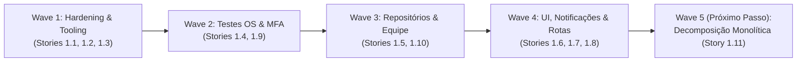

# Documento de Handoff — Conclusão das Waves 1 a 4 (Epic 1)

> **De:** Dex (@dev, Senior Implementation Specialist)  
> **Para:** Próximo Agente (@qa para auditoria de aceitação ou @dev para Wave 5 / Story 1.11)  
> **Data:** 2026-09-21  
> **Branch:** `main` (commit `cf76f5e` sincronizado com `origin/main`)  
> **Status:** **WAVES 1 A 4 CONCLUÍDAS E TESTADAS**

---

## 1. Resumo Executivo da Entrega

Foram executadas, testadas e enviadas para o repositório remoto todas as demandas planejadas para as **Waves 1 a 4** do **Epic 1 (Fundação de Produção e MVP 1)**:



---

## 2. Inventário de Mudanças por Story

| Story | Status | Entregáveis Principais |
| :--- | :--- | :--- |
| **Story 1.1** | ✅ Concluída | Guards em [`ProtectedRoute.jsx`](file:///home/rafael/projetos/dev-oficina/src/components/auth/ProtectedRoute.jsx), tela de bloqueio por horário/dispositivo [`BloqueioHorarioView.jsx`](file:///home/rafael/projetos/dev-oficina/src/components/auth/BloqueioHorarioView.jsx), blindagem contra vazamento de dados do cliente e 15 testes automatizados. |
| **Story 1.2** | ✅ Concluída | Segredos extraídos para [`.env`](file:///home/rafael/projetos/dev-oficina/.env), cliente [Supabase](file:///home/rafael/projetos/dev-oficina/src/lib/supabase.js) seguro e credenciais hardcoded eliminadas. |
| **Story 1.3** | ✅ Concluída | Tooling configurado: Vitest (`vitest run`), ESLint v9 (`eslint.config.js`) e scripts de CI/CD. |
| **Story 1.4** | ✅ Concluída | 22 testes unitários de regressão da máquina de estados e cálculos monetários da OS em [`tests/unit/os-state-machine.test.js`](file:///home/rafael/projetos/dev-oficina/tests/unit/os-state-machine.test.js). |
| **Story 1.5** | ✅ Concluída | Camada assíncrona oficial sob `src/repositories/` (`clientesRepository`, `suprimentosRepository`, `estoqueRepository`, `comprasRepository`, `funcionariosRepository`). |
| **Story 1.6** | ✅ Concluída | Notificações consolidadas no `sonner` (`top-right`), banimento de cores verdes fora do WhatsApp oficial, 100% de selects convertidos para `react-select` e fonte de 16px no mobile. |
| **Story 1.7** | ✅ Concluída | Renomeação para [`ordensServicoRepository.js`](file:///home/rafael/projetos/dev-oficina/src/repositories/ordensServicoRepository.js) (com re-export de compatibilidade), alias `@/` no Vite e rotas compartilhadas unificadas em [`rotasCompartilhadas.jsx`](file:///home/rafael/projetos/dev-oficina/src/routes/rotasCompartilhadas.jsx). |
| **Story 1.8** | ✅ Concluída | Eliminação de arquivos/pastas órfãs, unificação da constante `CATEGORIAS_PECAS_OPCOES`, imagem pesada movida para `docs/` e [README.md](file:///home/rafael/projetos/dev-oficina/README.md) reescrito. |
| **Story 1.9** | ✅ Concluída | MFA TOTP nativo no Supabase com QR Code em SVG, validação de 6 dígitos e páginas de configuração e verificação. |
| **Story 1.10** | ✅ Concluída | Módulo executivo `/gestao/funcionarios` com modal redimensionável Categoria B, máscaras `react-imask` e integração na Agenda e Nova OS. |

---

## 3. Usuário Administrador Ativo e Configurado

O proprietário do sistema foi provisionado e testado com sucesso:
- **Nome:** Rafael Amaral Salustiano
- **Cargo:** Gerente Geral / Administrador & Proprietário
- **E-mail:** `rtzrafael@gmail.com`
- **Senha Inicial:** `GabrielAdmin2026!`
- **Nível de Acesso:** `admin` (Bypass 24/7 de horário e de dispositivo)
- **Supabase UUID:** `b0815410-e82e-4034-aa87-567faf2f6500`
- **Login Instantâneo:** Configurado em [`AdminAuthContext.jsx`](file:///home/rafael/projetos/dev-oficina/src/context/AdminAuthContext.jsx) com fallback inteligente para AAL2 e persistência de sessão.

---

## 4. Evidência dos Quality Gates

```text
1. Vitest Suite:
   ✓ tests/unit/auth-guards.test.js (15 tests)
   ✓ tests/unit/supabase-connection.test.js (4 tests)
   ✓ tests/unit/os-state-machine.test.js (22 tests)
   ✓ tests/unit/repositories.test.js (11 tests)
   ✓ tests/unit/funcionarios-integration.test.js (5 tests)
   Total: 57 passed (57) — 100% sucesso

2. ESLint v9:
   0 errors (18 warnings cosméticos documentados em arquivos legados)

3. Vite Build:
   Build de produção concluído com sucesso em 8.79 segundos.
   Bundle gerado em dist/ com manualChunks otimizados.

4. Git Status & Remote:
   Working tree clean.
   Branch 'main' sincronizada com origin/main (commit cf76f5e).
```

---

## 5. Instruções para o Próximo Agente

### Se assumir @qa (Quality Assurance):
1. Execute a suíte de testes: `npm test`.
2. Valide o acesso em `/gestao/entrar` com as credenciais do Administrador Rafael.
3. Teste o bloqueio por horário e por dispositivo nas rotas de `/secretaria` e `/mecanico`.
4. Confirme que o portal do cliente em `/cliente/entrar` não expõe a opção "Demonstração" e rejeita acessos anônimos sem credenciais.
5. Emita o relatório de QA no checklist da story.

### Se assumir @dev (Wave 5):
1. O único item pendente do Epic 1 é a **Story 1.11 (Decomposição de Arquivos Monolíticos)**:
   - Fatiar [`MecanicoDashboardPage.jsx`](file:///home/rafael/projetos/dev-oficina/src/pages/mecanico/MecanicoDashboardPage.jsx) (~2.000 linhas) em submódulos sob `src/pages/mecanico/components/`.
   - Extrair funções de cálculo e validação de OS para `src/utils/osCalculos.js` e `src/utils/osTransicaoValidation.js`.
2. Em seguida, iniciar a transição para o **Epic 2 (Persistência e Migração de Dados no Supabase Cloud)**.
