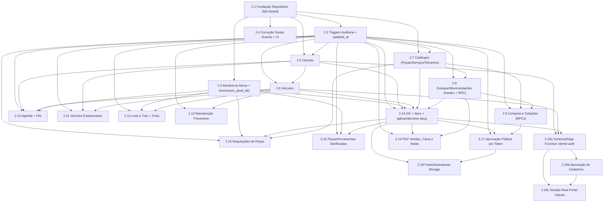

# Epic 2 — Persistência Real Supabase Postgres & RLS — Índice de Stories

**Status do Epic:** Validado pelo `@po` em 2026-09-24. Onda A (Fundação: 2.1, 2.2, 2.3, 2.4) em status **Ready** para início imediato da implementação pelo `@dev`. Ondas B–G validadas estruturalmente (Draft/Ready-for-Schema).
**Fonte:** `docs/prd.md` v1.5 §7 (Epic 2), ADR-005 (política de acesso a dados, fail-closed, concorrência), ADR-006 (tokens públicos e Storage), ADR-007 (autenticação do cliente por CPF), ADR-002/003/004, diagnóstico de segurança da Fase 0 (commit `b006f0d`).
**Pré-requisito operacional de todo o Epic 2:** as migrations `20260924120000_remover_dados_mock.sql` e `20260924130000_rls_papel_app_metadata.sql` foram **aplicadas** no projeto Supabase "Oficina" em 2026-09-26 (via CLI, junto com a `20260926120000` da Story 2.2); rotação da senha do admin e configuração dos secrets `SITE_URL`/`ALLOWED_ORIGINS` pendentes (ações do usuário, fora do escopo de código — ver Story 2.1 AC11).
**Regra de ouro de todo o Epic 2:** toda política RLS nova usa exclusivamente `public.papel_usuario()` (lê `app_metadata`, gravável só pelo servidor). É **proibido** usar `auth.jwt() -> 'user_metadata'` em qualquer política nova.
**Regras normativas adicionadas nesta rodada (ADR-005):** fail-closed sem fallback local em falha de chamada (Story 2.1); IDs gerados pelo banco (`gen_random_uuid()::text`) e números de negócio por `SEQUENCE`; gravação por linha com checagem de `updated_at` (concorrência otimista); RPCs transacionais para escritas em várias etapas; Story 2.2 (auditoria/`updated_at`) é pré-requisito de toda story que cria tabela nova.

---

## Documentos de Referência (ADRs desta rodada)

| ADR | Título | Escopo |
|---|---|---|
| [ADR-005](../architecture/project-decisions/adr-005-politica-acesso-dados-supabase.md) | Política de Acesso a Dados no Supabase — Fail-Closed, Escrita Atômica e Concorrência | Todas as stories 2.1–2.19 |
| [ADR-006](../architecture/project-decisions/adr-006-tokens-publicos-e-storage.md) | Acesso Público por Token e Armazenamento de Mídia no Supabase Storage | Stories 2.17, 2.18 |
| [ADR-007](../architecture/project-decisions/adr-007-autenticacao-cliente-por-cpf.md) | Autenticação do Cliente por CPF com Aprovação da Secretaria (OQ-4/G2.8) | Stories 2.20a, 2.20b, 2.20c |

---

## Lista de Stories por Onda

### Onda A — Fundação

| Story | Título | Executor / QG | Dependências | Status |
|---|---|---|---|---|
| [2.0](2.0.saneamento-arquitetural-e-decomposicao-monolitos.md) | Saneamento Arquitetural, Eliminação de Código Fantasma e Decomposição de Monólitos | @dev / @architect | Nenhuma | **Done** |
| [2.0b](2.0b.decomposicao-telas-mobile-e-pdv.md) | Decomposição das Telas Mobile de Suprimentos, do PDV e da Nova OS Mobile (ARCH-001) | @dev / @architect | 2.0 | **Done** |
| [2.0c](2.0c.decomposicao-patio-e-logistica.md) | Decomposição do Pátio e Logística (Lote 1 de Arquitetura) | @dev / @architect | 2.0, 2.0b | **Done** |
| [2.0d](2.0d.decomposicao-clientes-e-veiculos.md) | Decomposição de Clientes e Veículos (Lote 2 de Arquitetura) | @dev / @architect | 2.0c | **Done** |
| [2.0e](2.0e.decomposicao-agenda-e-fila.md) | Decomposição da Agenda Dinâmica e Fila de Espera (Lote 3 de Arquitetura) | @dev / @architect | 2.0d | **Done** |
| [2.1](2.1.fundacao-repositorio-supabase.md) | Fundação do Cliente Supabase e Camada de Repositório Assíncrona (fail-closed, ADR-005) | @dev / @architect | Nenhuma | **Done** |
| [2.2](2.2.triggers-auditoria-e-updated-at.md) | Triggers de Auditoria Imutável e `updated_at` Automático | @data-engineer / @dev | 2.1 | **Done** |
| [2.3](2.3.view-rpc-mecanicos-ativos.md) | View/RPC de Mecânicos Ativos + `funcionario_atual_id()` | @data-engineer / @dev | 2.1 | **Done** |
| [2.4](2.4.correcao-testes-guards-e-ci-epic2.md) | Correção de `auth-guards.test.js` e Gate de CI do Epic 2 | @dev / @qa | 2.1 | **InReview** |

### Onda B — Cadastros

| Story | Título | Executor / QG | Dependências |
|---|---|---|---|
| [2.5](2.5.migracao-clientes-supabase.md) | Migração de Clientes para Supabase Postgres | @dev / @data-engineer | 2.1, 2.2 |
| [2.6](2.6.migracao-veiculos-supabase.md) | Migração de Veículos (com criação do repositório dedicado) | @dev / @data-engineer | 2.5, 2.2 |
| [2.7](2.7.migracao-catalogos-pecas-servicos-terceiros.md) | Migração de Catálogos: Peças, Serviços e Terceiros (RLS FR25) | @dev / @data-engineer | 2.1, 2.2 |

### Onda C — Suprimentos

| Story | Título | Executor / QG | Dependências |
|---|---|---|---|
| [2.8](2.8.migracao-estoque-movimentacoes.md) | Migração de Estoque e Movimentações (Kardex, RPC transacional) | @dev / @data-engineer | 2.7, 2.2 |
| [2.9](2.9.migracao-compras-e-cotacoes.md) | Migração de Compras (Pedidos) e Cotações (RPCs transacionais) | @dev / @data-engineer | 2.7, 2.8, 2.2 |

### Onda D — Pátio

| Story | Título | Executor / QG | Dependências |
|---|---|---|---|
| [2.10](2.10.migracao-agenda-e-fila-espera.md) | Migração da Agenda Dinâmica e Fila de Espera (novas tabelas) | @dev / @data-engineer | 2.2, 2.3, 2.5, 2.6 |
| [2.11](2.11.migracao-veiculos-estacionados.md) | Migração de Veículos Estacionados (nova tabela) | @dev / @data-engineer | 2.2, 2.5, 2.6 |
| [2.12](2.12.migracao-leva-e-traz-frota-apoio.md) | Migração de Leva e Traz + Frota de Apoio (novas tabelas) | @dev / @data-engineer | 2.2, 2.3, 2.6 |
| [2.13](2.13.migracao-manutencao-preventiva.md) | Migração de Manutenção Preventiva (nova tabela, RPC de hodômetro) | @dev / @data-engineer | 2.2, 2.6 |

### Onda E — Ordem de Serviço Completa

| Story | Título | Executor / QG | Dependências |
|---|---|---|---|
| [2.14](2.14.migracao-ordem-servico-itens.md) | Migração do Núcleo da OS + Itens + RPCs `aplicar_peca_na_os`/`devolver_peca_da_os` | @dev / @data-engineer | 2.2, 2.3, 2.5, 2.6, 2.7, 2.8 |
| [2.15](2.15.requisicoes-pecas-supabase.md) | Requisições de Peças do Mecânico (nova tabela, D5 — vê só as próprias) | @dev / @data-engineer | 2.14, 2.7, 2.3, 2.2 |
| [2.16](2.16.pecas-ferramentas-danificadas-supabase.md) | Peças e Ferramentas Danificadas (novas tabelas) | @dev / @data-engineer | 2.14, 2.3, 2.2 |
| [2.17](2.17.aprovacao-publica-por-token.md) | Acesso Público Seguro por Token — `tokens_acesso_publico` (ADR-006) | @data-engineer / @architect | 2.9, 2.14, 2.2 |
| [2.18](2.18.fotos-assinaturas-storage.md) | Fotos e Assinaturas de Vistoria no Storage + Edge Function `acesso-publico-midia` | @dev / @architect | 2.14, 2.17 |

### Onda F — PDV

| Story | Título | Executor / QG | Dependências |
|---|---|---|---|
| [2.19](2.19.migracao-pdv-vendas-notas.md) | Migração do PDV: Vendas, Caixa do Dia e Notas Fiscais Simuladas | @dev / @data-engineer | 2.14, 2.8, 2.2 |

### Onda G — Portal do Cliente (substitui a Story 2.20, agora Superseded)

| Story | Título | Executor / QG | Dependências |
|---|---|---|---|
| [2.20](2.20.autenticacao-real-portal-cliente.md) | ~~Autenticação Real do Portal do Cliente~~ — **SUPERSEDED**, ver 2.20a/b/c | — | — |
| [2.20a](2.20a.cadastro-cliente-schema-rls-edge-function.md) | Schema (`cadastros_clientes`, RLS de duas travas) + Edge Function `cliente-auth` (ADR-007) | @dev / @architect | ADR-007, 2.5, 2.6, 2.14 |
| [2.20b](2.20b.aprovacao-cadastros-clientes.md) | Tela FR24 (cadastros pendentes) + RPCs de aprovação/recusa/revogação + recuperação assistida | @dev / @architect | 2.20a |
| [2.20c](2.20c.sessao-real-portal-cliente.md) | Sessão real (`ProtectedRoute`/`ClienteContext`), rota pública de cadastro, retenção LGPD | @dev / @architect | 2.20a, 2.20b |

---

## Ordem de Execução Recomendada

```
2.4 (correção de testes de guard, pode rodar em paralelo, mas recomendada cedo)
  ↓
2.1 (fundação fail-closed)
  ↓
2.2 (auditoria/updated_at — pré-requisito de TODA story que cria tabela nova)
2.3 (mecânicos ativos + funcionario_atual_id())
  ↓
2.5 (Clientes)
  ↓
2.6 (Veículos) ── 2.7 (Catálogos)
  ↓                  ↓
  │              2.8 (Estoque/Kardex)
  │                  ↓
  │              2.9 (Compras/Cotações)
  ↓
2.10, 2.11, 2.12, 2.13 (Ondas D, em paralelo entre si após 2.6/2.2/2.3)
  ↓
2.14 (núcleo da OS — depende de 2.2, 2.3, 2.5, 2.6, 2.7, 2.8)
  ↓
2.15, 2.16, 2.19 (dependem de 2.14; 2.19 também de 2.8)
  ↓
2.17 (token público — depende de 2.9 e 2.14)
  ↓
2.18 (Storage — depende de 2.17)
  ↓
2.20a (schema/Edge Function — depende de 2.5, 2.6, 2.14, ADR-007)
  ↓
2.20b (aprovação — depende de 2.20a)
  ↓
2.20c (sessão real — depende de 2.20a, 2.20b)
```

`2.4` não bloqueia tecnicamente as demais (só depende de `2.1`), mas é recomendada cedo por reduzir o risco de regressão silenciosa nos guards de autenticação enquanto o restante do Epic 2 avança.

---

## Diagrama de Dependências



---

## Open Questions e Decisões Pendentes

### Resolvidas nesta rodada (2026-09-24)

1. ~~**OQ-3 (rede da oficina)**~~ — permanece **fora do escopo do Epic 2**, sem ADR próprio; nenhuma story deste índice implementa allowlist de rede/IP (ver PRD §4.6). Não é uma OQ do Epic 2, apenas reafirmada como não-agendada.
2. **OQ-4 (credencial do cliente por CPF) — RESOLVIDA pelo ADR-007.** Opção B aprovada pelo proprietário: Edge Function `cliente-auth` com e-mail sintético por HMAC. Stories 2.20a/2.20b/2.20c implementam.
3. **OQ-5 (interpretações do fluxo de aprovação do cliente) — RESOLVIDA parcialmente pelo proprietário em 2026-09-24, ver ADR-007 e Stories 2.20b/2.20c:**
   - Local da tela: dentro do módulo Clientes (confirmado).
   - Procedimento de conferência de identidade: telefone já cadastrado, quando o CPF existe (confirmado); procedimento para CPF totalmente novo **permanece em aberto** (Story 2.20b).
   - Retenção de dados: 3 anos para cadastros aprovados e recusados; 30+30 dias para pendentes nunca decididos (confirmado, Story 2.20c).
   - Exclusão de conta na recusa: imediata (confirmado, Story 2.20b).
4. **[Negócio] Story 2.7 — a Secretaria pode cadastrar/editar Peças, Serviços e Terceiros? RESOLVIDA pelo FR25 (PRD v1.4).** Sim, com `DELETE` exclusivo do admin.
5. **[Negócio] Story 2.8 — quem pode registrar movimentação de estoque? PARCIALMENTE RESOLVIDA.** Secretaria: `SELECT`/`INSERT` (FR25). Mecânico: **decisão fechada — nunca lança movimentação manual** (D5); a baixa por uso de peça é sempre automática via RPC (Story 2.14).
6. **[Negócio] Story 2.9 — a Secretaria pode criar/editar Pedidos de Compra e Cotações? RESOLVIDA pelo FR25.** Sim, com `DELETE` exclusivo do admin.
7. **[Negócio] Story 2.17 — quebra de contrato de URL pública. RESOLVIDA (D6, proprietário, 2026-09-24).** Quebra única, sem janela de compatibilidade com `:id` — não há links em produção.
8. **[Negócio] FR14 (migração de `localStorage`). RESOLVIDA — removido do escopo do PRD v1.4.** Nenhuma story do Epic 2 implementa ferramenta de import/export; toda menção residual a "migração de formato legado" foi removida das stories nesta rodada (ex.: Story 2.6 AC4).
9. **[Negócio] Baixa de estoque no ciclo da OS — RESOLVIDA (proprietário, 2026-09-24).** Ponto único de baixa: no uso da peça na OS (`aplicar_peca_na_os`, Story 2.14); PDV baixa só o que restar (Story 2.19). Mecânico nunca lança movimentação manual (D5 fechado).
10. **[Negócio] PDV fora do horário comercial — RESOLVIDA (proprietário, 2026-09-24).** Secretaria pode vender fora de 08h-19h enquanto o caixa do dia estiver aberto (novo conceito de `pdv_caixas`, Story 2.19); admin irrestrito.
11. **[Negócio] Janela operacional (D4) para Veículos/Suprimentos — RESOLVIDA (proprietário, 2026-09-24).** Aplica-se a Veículos e Suprimentos (secretaria/mecânico); não se aplica a Clientes. Interpretação registrada, sujeita a confirmação formal.

### Ainda em aberto

12. **[Design de Segurança] Story 2.17 — modelo de token.** Já decidido pelo ADR-006 (tabela dedicada `tokens_acesso_publico`, um token por par cotação/fornecedor) — não é mais uma decisão em aberto, mas a implementação exige revisão de segurança dedicada do `@architect` no gate.
13. **[Produto] Story 2.16 — sobreposição entre o fluxo de "Peças Danificadas" do mecânico (já funcional) e a rota placeholder de Gestão/Secretaria (`/gestao/pecas-danificadas`).** Ainda não esclarecida com `@po` — não bloqueia a Story 2.16 (persistência), mas é item de backlog.
14. **Story 2.20b — procedimento de conferência de identidade para CPF totalmente novo** (sem registro prévio em `clientes`). Não decidido; a Secretaria precisa de uma alternativa operacional documentada até a formalização.
15. **Story 2.20c — procedimento final de descarte do registro de cadastro aos 3 anos** (o que exatamente é apagado) e texto do termo de consentimento — a confirmar com `@po`/jurídico.
16. **[Segurança] Story 2.20a — validação do domínio de e-mail sintético `.invalid`** no Supabase Auth do projeto real — bloqueante para a abordagem de e-mail sintético se não for aceito.
17. **[Arquitetura] Story 2.14 — avaliação de divisão da story (tamanho XL).** Registrada como opção a exercer na validação do `@po`, não decidida nesta rodada.

---

## Notas de Rastreabilidade

- As 4 stories da Onda A (2.1, 2.2, 2.3, 2.4) foram validadas pelo `@po` (`*validate-story-draft`) e estão em Status **Ready** para implementação imediata. As demais stories (2.5–2.19, 2.20a–c) tiveram sua estrutura e escopo validados em Draft/Ready-for-Schema; a Story 2.20 está formalmente **Superseded**.
- Nenhuma story desta rodada implementou código de aplicação — apenas os artefatos de story em `docs/stories/`.
- Onda E (2.14–2.18) e Onda G (2.20a–c) concentram o maior risco técnico e de segurança do Epic 2 (núcleo da OS, ponto único de baixa de estoque, acesso público por token, upload de mídia sensível, autenticação de cliente por CPF) — recomenda-se ao `@po`/`@architect` priorizar revisão cuidadosa dessas 8 stories antes de liberar `Ready`.
- A tela de **Garantias** foi deliberadamente excluída desta rodada de ajustes, por decisão do proprietário de adiar esse módulo — nenhuma story do Epic 2 a referencia.
- Correções de padronização aplicadas a todas as 20 stories originais nesta rodada: seções **Escopo (IN/OUT)**, **Estimativa** (T-shirt: P/M/G/XL) e **Definition of Done** adicionadas; seção **Riscos** adicionada onde faltava (2.7, 2.12, 2.13, 2.16); AC6 truncado da Story 2.6 corrigido; resíduo de migração de formato legado do FR14 removido do AC4 da Story 2.6.
