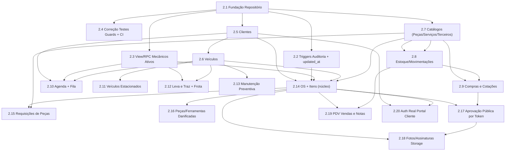

# Epic 2 — Persistência Real Supabase Postgres & RLS — Índice de Stories

**Status do Epic:** Stories em Draft, aguardando validação `@po` (`*validate-story-draft`) e, para as stories com desenho de schema novo, revisão do `@data-engineer`/`@architect` antes de `Ready`.
**Fonte:** `docs/prd.md` §7 (Epic 2), `docs/architecture/supabase-persistence-model.md`, ADR-002/003/004 (`docs/architecture/project-decisions/`), diagnóstico de segurança da Fase 0 (commit `b006f0d`).
**Pré-requisito operacional de todo o Epic 2:** as migrations `20260924120000_remover_dados_mock.sql` e `20260924130000_rls_papel_app_metadata.sql` devem estar aplicadas no projeto Supabase alvo; rotação da senha do admin e configuração dos secrets `SITE_URL`/`ALLOWED_ORIGINS` pendentes (ações do usuário, fora do escopo de código — ver Story 2.1 AC9).
**Regra de ouro de todo o Epic 2:** toda política RLS nova usa exclusivamente `public.papel_usuario()` (lê `app_metadata`, gravável só pelo servidor). É **proibido** usar `auth.jwt() -> 'user_metadata'` em qualquer política nova — o documento `docs/architecture/supabase-persistence-model.md` está desatualizado nesse ponto e não deve ser seguido literalmente (ver Story 2.1, Inconsistência 1).

---

## Lista de Stories por Onda

### Onda A — Fundação

| Story | Título | Executor / QG | Dependências |
|---|---|---|---|
| [2.1](2.1.fundacao-repositorio-supabase.md) | Fundação do Cliente Supabase e Camada de Repositório Assíncrona | @dev / @architect | Nenhuma |
| [2.2](2.2.triggers-auditoria-e-updated-at.md) | Triggers de Auditoria Imutável e `updated_at` Automático | @data-engineer / @dev | 2.1 |
| [2.3](2.3.view-rpc-mecanicos-ativos.md) | View/RPC de Mecânicos Ativos (Regra 14) | @data-engineer / @dev | 2.1 |
| [2.4](2.4.correcao-testes-guards-e-ci-epic2.md) | Correção de `auth-guards.test.js` e Gate de CI do Epic 2 | @dev / @qa | 2.1 |

### Onda B — Cadastros

| Story | Título | Executor / QG | Dependências |
|---|---|---|---|
| [2.5](2.5.migracao-clientes-supabase.md) | Migração de Clientes para Supabase Postgres | @dev / @data-engineer | 2.1 |
| [2.6](2.6.migracao-veiculos-supabase.md) | Migração de Veículos (com criação do repositório dedicado) | @dev / @data-engineer | 2.5 |
| [2.7](2.7.migracao-catalogos-pecas-servicos-terceiros.md) | Migração de Catálogos: Peças, Serviços e Terceiros | @dev / @data-engineer | 2.1 |

### Onda C — Suprimentos

| Story | Título | Executor / QG | Dependências |
|---|---|---|---|
| [2.8](2.8.migracao-estoque-movimentacoes.md) | Migração de Estoque e Movimentações (Kardex) | @dev / @data-engineer | 2.7 |
| [2.9](2.9.migracao-compras-e-cotacoes.md) | Migração de Compras (Pedidos) e Cotações | @dev / @data-engineer | 2.7, 2.8 |

### Onda D — Pátio

| Story | Título | Executor / QG | Dependências |
|---|---|---|---|
| [2.10](2.10.migracao-agenda-e-fila-espera.md) | Migração da Agenda Dinâmica e Fila de Espera (novas tabelas) | @dev / @data-engineer | 2.3, 2.5, 2.6 |
| [2.11](2.11.migracao-veiculos-estacionados.md) | Migração de Veículos Estacionados (nova tabela) | @dev / @data-engineer | 2.5, 2.6 |
| [2.12](2.12.migracao-leva-e-traz-frota-apoio.md) | Migração de Leva e Traz + Frota de Apoio (novas tabelas) | @dev / @data-engineer | 2.3, 2.6 |
| [2.13](2.13.migracao-manutencao-preventiva.md) | Migração de Manutenção Preventiva (nova tabela) | @dev / @data-engineer | 2.6 |

### Onda E — Ordem de Serviço Completa

| Story | Título | Executor / QG | Dependências |
|---|---|---|---|
| [2.14](2.14.migracao-ordem-servico-itens.md) | Migração do Núcleo da OS + Itens (JSONB) | @dev / @data-engineer | 2.2, 2.3, 2.5, 2.6, 2.7 |
| [2.15](2.15.requisicoes-pecas-supabase.md) | Requisições de Peças do Mecânico (nova tabela) | @dev / @data-engineer | 2.14, 2.7 |
| [2.16](2.16.pecas-ferramentas-danificadas-supabase.md) | Peças e Ferramentas Danificadas (novas tabelas) | @dev / @data-engineer | 2.14 |
| [2.17](2.17.aprovacao-publica-por-token.md) | Acesso Público Seguro por Token (Cotação/Aprovação/Orçamento/Vistoria) | @data-engineer / @architect | 2.9, 2.14 |
| [2.18](2.18.fotos-assinaturas-storage.md) | Fotos e Assinaturas de Vistoria no Supabase Storage | @dev / @architect | 2.14, 2.17 |

### Onda F — PDV

| Story | Título | Executor / QG | Dependências |
|---|---|---|---|
| [2.19](2.19.migracao-pdv-vendas-notas.md) | Migração do PDV (Vendas e Notas Fiscais Simuladas) | @dev / @data-engineer | 2.14, 2.8 |

### Onda G — Portal do Cliente

| Story | Título | Executor / QG | Dependências |
|---|---|---|---|
| [2.20](2.20.autenticacao-real-portal-cliente.md) | Autenticação Real do Portal do Cliente via Supabase Auth (FR18) | @dev / @architect | 2.5, 2.14 |

---

## Diagrama de Dependências

---

## Open Questions e Decisões Pendentes (para `@architect` / `@po`)

1. **[Segurança/Arquitetura] `docs/architecture/supabase-persistence-model.md` precisa de atualização.** O documento usa `auth.jwt() -> 'user_metadata'` (padrão inseguro, corrigido na Fase 0 pela migration `20260924130000_rls_papel_app_metadata.sql`, que introduziu `public.papel_usuario()`) e modela IDs como `UUID` quando o schema real usa `TEXT`. Recomenda-se ao `@architect` revisar e atualizar o documento para não induzir a regressão de segurança em leituras futuras. **Não bloqueia** as stories (todas já instruem usar `papel_usuario()`/`TEXT`), mas é dívida documental.
2. **[Design de Segurança] Story 2.17 — modelo de token de acesso público (coluna vs. tabela dedicada).** Decisão técnica do `@data-engineer`, mas com impacto de segurança suficiente para pedir revisão do `@architect` antes da implementação (Quality Gate da própria story já é `@architect`).
3. **[Negócio] Story 2.7 — a Secretaria deve poder cadastrar/editar Peças, Serviços e Terceiros?** Hoje a migration só concede `INSERT`/`UPDATE` de catálogos ao `admin`. Se a operação real do balcão exige que a secretaria cadastre peças/fornecedores, é necessária uma migration de RLS incremental. Decisão de `@po`.
4. **[Negócio] Story 2.8 — quem pode registrar/ajustar movimentação de estoque?** Hoje só `admin` tem qualquer acesso à tabela `estoque_movimentacoes`. Default proposto: `secretaria`/`mecanico` podem `SELECT`/`INSERT` (append-only), `UPDATE`/`DELETE` restritos ao admin. Decisão de `@po`/`@architect`.
5. **[Negócio] Story 2.9 — a Secretaria deve poder criar/editar Pedidos de Compra e Cotações?** Mesmo padrão de gap de RLS admin-only. Decisão de `@po`.
6. **[Negócio] Story 2.17 — quebra de contrato de URL pública.** Trocar `/aprovacao/:id` por `/aprovacao/:token` invalida qualquer link já enviado a um cliente/fornecedor antes da migração. Decisão de `@po`: aceitar quebra pontual (sistema ainda não está em produção real) ou implementar janela de transição aceitando ambos os formatos.
7. **[Produto] Story 2.16 — sobreposição entre o fluxo de "Peças Danificadas" do mecânico (já funcional) e a rota placeholder de Gestão/Secretaria (`/gestao/pecas-danificadas`, ainda não implementada).** `docs/oficina/PecasDanificadas.md` (162 linhas) precisa ser lido e confrontado com o código real antes de decidir se é necessária uma tela de consulta/relatório consolidado separada — não é bloqueante da Story 2.16 (persistência), mas é um item de escopo a esclarecer com `@po` para o backlog.
8. **[Negócio/Arquitetura] Story 2.20 — qual identificador de login o cliente usa (e-mail vs. telefone)?** Nem todo cliente PF cadastrado tem e-mail no formulário atual. Decisão de `@architect`/`@po` antes de implementar o fluxo de ativação via WhatsApp — pode exigir tornar e-mail obrigatório no cadastro de cliente que receberá acesso ao portal, ou adotar autenticação por telefone/SMS (custo adicional de provedor).
9. **[Escopo/PRD] FR14 (migração de `localStorage` para Postgres) pode não ser mais necessária como ferramenta formal de import/export.** Como os dados mock/de demonstração já foram removidos (commit `20260924120000_remover_dados_mock.sql`) e o sistema ainda não está em uso real com dados de produção em `localStorage`, o Gate G2.4 do PRD (ferramenta de export/import com dry-run e rollback) pode ter sido concebido para um cenário que não se concretizou. Recomenda-se ao `@po` reavaliar se FR14 vira um utilitário opcional de importação (ex.: script único de contingência, não uma feature de produto) ou se é removido do escopo do Epic 2. **Nenhuma story desta rodada implementa FR14** — decisão pendente antes de criar uma story dedicada a ela, se necessário.
10. **[Fora do escopo do Epic 2, não confundir] OQ-3 do PRD (restrição de acesso por rede da oficina) permanece não resolvida e não agendada.** Nenhuma story deste índice implementa allowlist de rede/IP — isso depende de ADR específico do `@architect` (PRD §4.6), e o próprio PRD proíbe explicitamente criar essa story antes do ADR.

---

## Notas de Rastreabilidade

- Todas as 20 stories foram criadas com Status **Draft**, prontas para `@po *validate-story-draft`.
- Nenhuma story desta rodada implementou código de aplicação — apenas os artefatos de story em `docs/stories/`.
- Onda E (2.14–2.18) concentra o maior risco técnico e de segurança do Epic 2 (núcleo da OS, acesso público por token, upload de mídia sensível) — recomenda-se ao `@po`/`@architect` priorizar revisão cuidadosa dessas 5 stories antes de liberar `Ready`.
